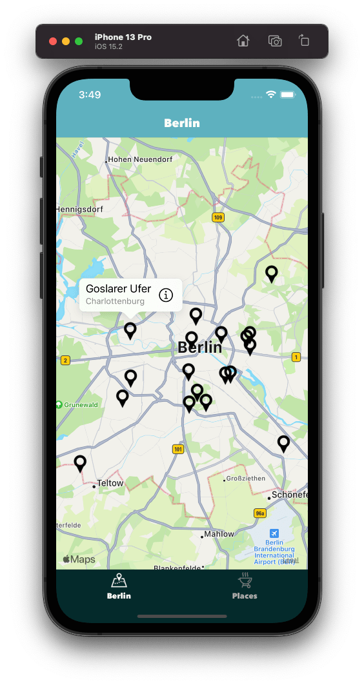
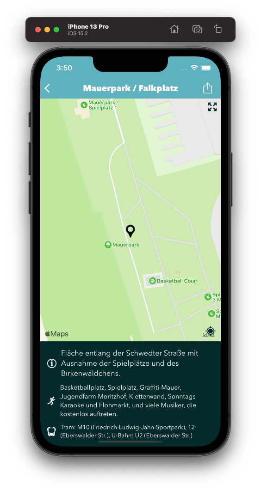
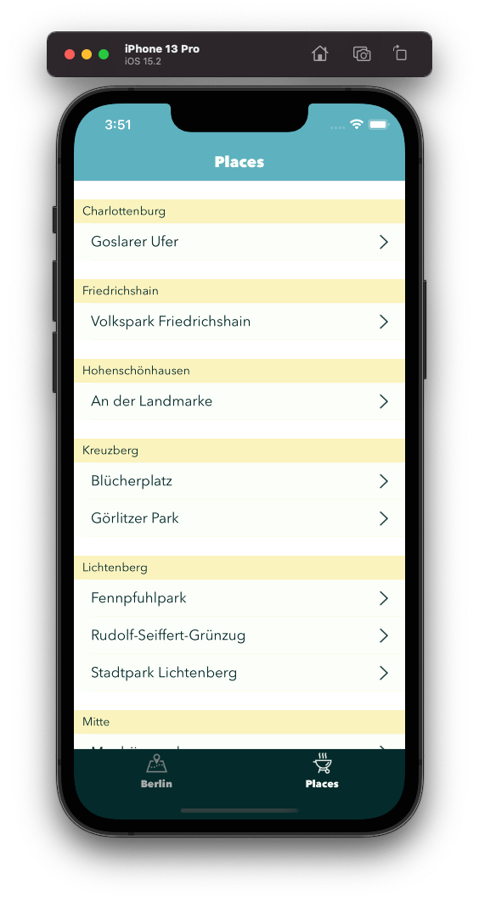

 

# BBQ. Grilling spots in Berlin - iOS App

Full source of an `iOS` app with information about public grilling spots in Berlin (state of `July 2014`). The app was available in the AppStore for two years (`2014`-`2016`). It was created as a weekend project in **March 2014**. At the time of writing `Objective-C` was the leading iOS programming language. Two months after the first commit had been pushed to the repo, on June 2, 2014, Apple announced Swift.

# What's inside

- Map with grilling spots of Berlin
- Closest bus, tram or underground stops
- Description of the area around the grilling spot

Map | Details | List
:-:|:-:|:-:
 |  | 

# Technologies used

- Objective-C
- CoreData
- MapKit
- JSON
- Autolayout

# What could be improved

The app is production ready, updated to run in latest IDEs, but couple of things could be either added or improved. Please remember that the app was written in 2014 and many things have changed since then.

- Adding unit tests for creation of `CoreData` stack and importing initial data from a JSON file
- Adding more comments to the code
- Simplifying autolayout logic in `RAFDetailViewController`

# License

This code is distributed under the terms and conditions of the [GNU GPLv3](https://choosealicense.com/licenses/gpl-3.0/) license.

Copyright (c) 2014-2022 Rafał Sroka

# Acknowledgements

Icons used in the app come from [flaticon.com](https://www.flaticon.com/).

